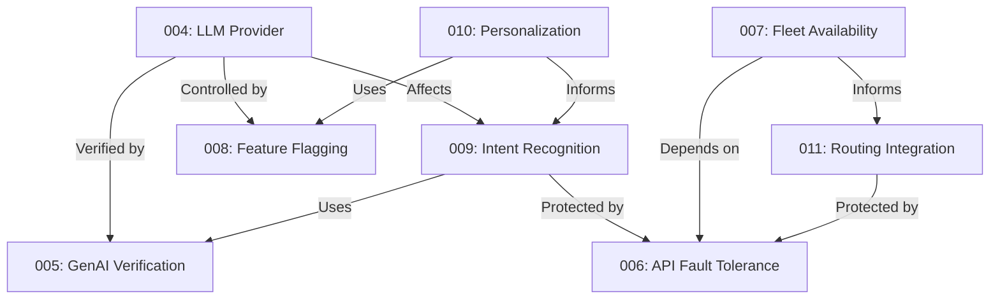

# MobilityCorp Chat & Vehicle Analytics ADR Index

## Overview
This document indexes and relates all Architecture Decision Records (ADRs) for the MobilityCorp system, showing their relationships and dependencies.

## Core System ADRs

### AI/ML Foundation
1. [LLM Provider Selection](004-llm-provider-selection.md)
   - Primary decision for AI backbone
   - Dependencies:
     - [Feature Flagging](008-feature-flagging.md)
     - [GenAI Output Verification](005-genai-output-verification.md)
     - [Intent Recognition](009-intent-recognition.md)

2. [Intent Recognition Approach](009-intent-recognition.md)
   - Natural language understanding strategy
   - Dependencies:
     - [LLM Provider Selection](004-llm-provider-selection.md)
     - [GenAI Output Verification](005-genai-output-verification.md)

### System Reliability
3. [API Fault Tolerance](006-api-fault-tolerance.md)
   - Foundation for system resilience
   - Related to:
     - [Routing Integration](011-routing-integration.md)
     - [Fleet Availability](007-fleet-availability.md)

4. [Feature Flagging for AI](008-feature-flagging.md)
   - Control system for AI features
   - Impacts:
     - [LLM Provider](004-llm-provider-selection.md)
     - [Intent Recognition](009-intent-recognition.md)
     - [GenAI Verification](005-genai-output-verification.md)

### Data Management
5. [Fleet Availability Architecture](007-fleet-availability.md)
   - Real-time vehicle tracking
   - Dependencies:
     - [API Fault Tolerance](006-api-fault-tolerance.md)

6. [Personalization and Privacy](010-personalization-privacy.md)
   - User data handling strategy
   - Related to:
     - [Feature Flagging](008-feature-flagging.md)
     - [Intent Recognition](009-intent-recognition.md)

### External Integrations
7. [Routing Integration](011-routing-integration.md)
   - Maps and routing strategy
   - Dependencies:
     - [API Fault Tolerance](006-api-fault-tolerance.md)
     - [Fleet Availability](007-fleet-availability.md)

## Decision Relationships

## Implementation Categories

### Critical Path Components
- LLM Provider Selection (004)
- API Fault Tolerance (006)
- Fleet Availability (007)

### Safety & Control
- GenAI Output Verification (005)
- Feature Flagging (008)
- Personalization & Privacy (010)

### User Experience
- Intent Recognition (009)
- Routing Integration (011)

## Review Status
All ADRs are currently accepted and implemented. Regular reviews should focus on:
1. Performance metrics validation
2. Compliance updates
3. Cost optimization
4. Technology evolution

## Next Steps
1. Monitor implementation success
2. Gather metrics on chosen approaches
3. Plan for potential architectural evolution
4. Regular security and privacy audits

## Additional Resources
- [System Architecture Overview](../README.md)
- [Implementation Guidelines](../docs/implementation.md)
- [Security Policies](../docs/security.md)