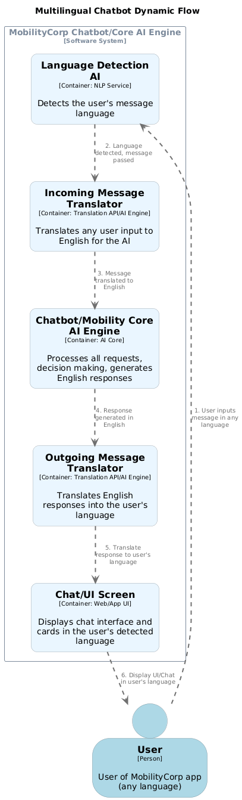

# Multilingual Support for MobilityCorp: Powered by the Core AI Engine

With MobilityCorp expanding across Europe, offering high-quality multilingual support is essential to connect with users in their native languages and maximize satisfaction. The **MobilityCorp Core AI Engine** enables seamless, AI-powered translation and localization throughout the platform.

---

## **Why Is Multilingual Service Vital?**

- **Diverse User Base:** Serves users in English, French, German, Spanish, Italian, Dutch, Polish, and more.
- **User Confidence:** Enhances comfort and trust by providing information in users’ preferred languages.
- **Regulatory Compliance:** Meets legal requirements for local language support in European markets.
- **Accessibility & Growth:** Makes MobilityCorp more inclusive and competitive.

---

## **How the Core AI Engine Delivers Multilingual Capabilities**

### **1. Dynamic Language Detection and Translation**

- Every user message (chat, support, booking) is analyzed by the Core AI Engine.
- The engine instantly detects the input language, removing the need for users to manually switch language settings.

### **2. Real-Time AI Translation**

- User messages are translated into the platform’s processing language (e.g., English).
- The Core AI Engine processes requests, books trips, answers questions, and then translates responses back to the user’s language before presenting them.
- Supports both voice and text communications in the user’s chosen language.

### **3. Unified Experience Across Channels**

- All communications—chatbot, email, push notifications, booking details—use the same AI-powered translation.
- Rich content (app screens, maps, route cards, help info) is dynamically translated before display.

### **4. Context & Quality Assurance**

- The Core AI Engine uses advanced context understanding to ensure that translations retain intent, tone, and technical accuracy.
- Users can provide feedback on translations, and the engine learns continuously to improve quality.
- Mission-critical text (legal, payments) can default to expert-translated content for extra reliability.

### **5. Easy Expansion**

- Supporting new languages is fast—simply update translation models and Core AI capabilities, with no need to rebuild interfaces or workflows.
- The system adapts for slang, idioms, and region-specific terms.

---

## **Multilingual Chat Workflow (Powered by Core AI Engine)**

---

## **Benefits**

- One unified platform serving all regions, languages, and channels
- Users always interact in their language, without confusing interfaces or missed details
- Rapid rollout of new languages and support for market growth
- Lower support costs and more consistent experience thanks to AI automation

---

## **Summary**

By making the **MobilityCorp Core AI Engine** the backbone of multilingual support, MobilityCorp ensures every user—no matter their language—gets clear, accurate, friendly, and local service. This drives user satisfaction, trust, and long-term loyalty across Europe and beyond.
