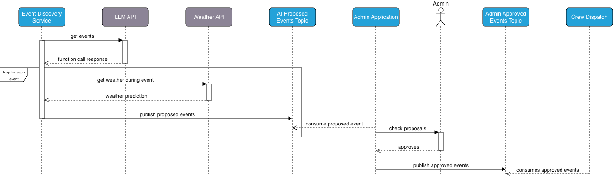
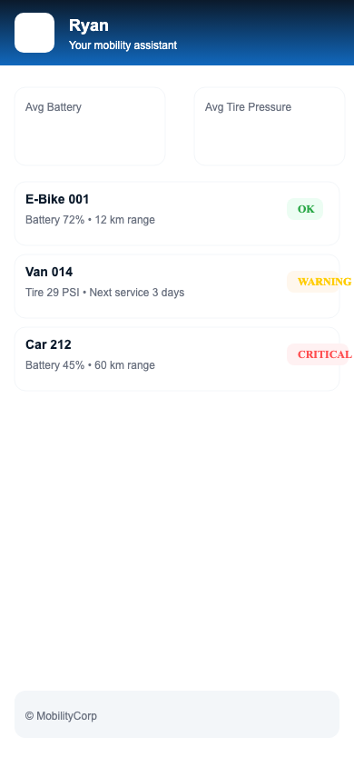
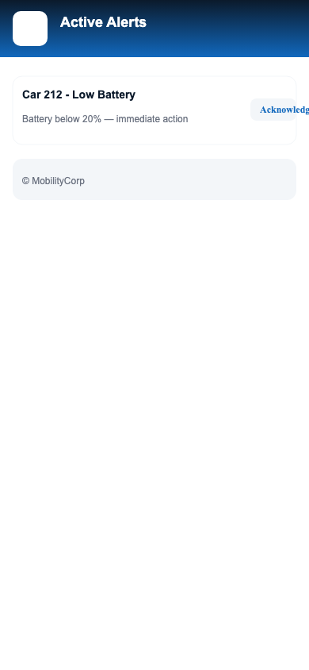
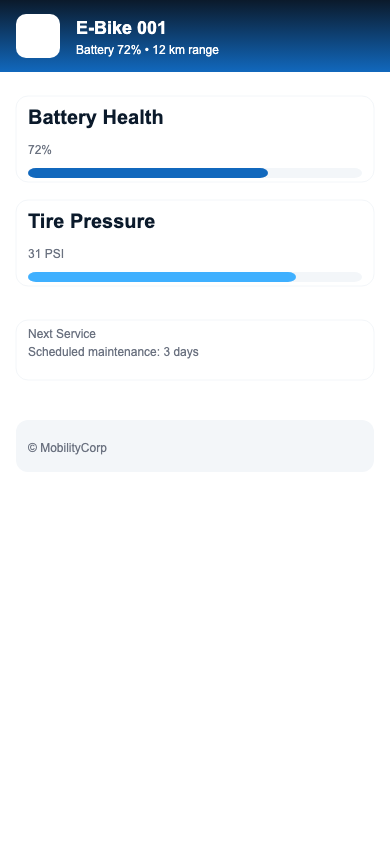

# MobilityCorp Intelligent Fleet Management Solution
O'Reilly Architectural Kata Q4 2025

Team  **Katalysis**
## Repository Navigation 🗺️

- [📋 Problem Background](./Problem%20Background/ProblemBackground.md)
- [📝 Architecture Decision Records](./ADR/)
  - [Chat Bot ADRs](./ADR/chat-bot/)
    - [API Fault Tolerance](./ADR/chat-bot/003-api-fault-tolerance.md)
    - [Fleet Availability](./ADR/chat-bot/004-fleet-availability.md)
    - [Personalization & Privacy](./ADR/chat-bot/007-personalization-privacy.md)
    - [Routing Integration](./ADR/chat-bot/008-routing-integration.md)
  - [Vehicle Analytics ADRs](./ADR/vehicle-analytics/)
    - [Edge Processing Strategy](./ADR/vehicle-analytics/001-edge-processing-strategy.md)
    - [Time Series Storage](./ADR/vehicle-analytics/002-time-series-storage.md)
  - [System Manager ADRs](./ADR/system-manager/) 🆕
    - [Vehicle Health Records](./ADR/system-manager/VehicleHealthUpdate.md)
    - [Training on Booking History](./ADR/system-manager/TrainingOnBookingHistory.md)
  - [Battery Swap Strategy ADRs](./ADR/C2-bulk-battery-swap-and-reposition-for-event/)
- [📊 Architecture Diagrams](./Diagrams/)
  - [Vehicle Analytics](./Diagrams/vehicle-analytics/)
    - [Context & Containers](./Diagrams/vehicle-analytics/VehicleAnalytics-Context.png)
    - [Data Collection](./Diagrams/vehicle-analytics/DataCollection.png)
    - [Processing](./Diagrams/vehicle-analytics/Processing.png)
    - [Storage](./Diagrams/vehicle-analytics/Storage.png)
  - [Chat Bot Architecture](./Diagrams/chat-bot/)
    - [Container View](./Diagrams/chat-bot/chatbot-container.png)
    - [UI Screens](./Diagrams/chat-bot/screens/)
  - [System Management](./Diagrams/system-manager/) 🆕
    - [Vehicle Health Records Flow](./Diagrams/system-manager/vhr-flow.png)
  - [Verification Flows](./Diagrams/verification/)
  - [Validation Strategy](./Diagrams/validation/)
  - [Vehicle Inspection AI](./Diagrams/vehicle-inspection-using-ai/)
  - [Battery Management](./Diagrams/C2-bulk-battery-swap-and-reposition-for-event/)
- [📚 Requirements](./Requirements/)
  - [Functional Requirements](./Requirements/Functional/)
  - [Non-Functional Requirements](./Requirements/NonFunctional/)
- [🔍 Verification and Validation](./Verification%20and%20Validation/)
  - [Validation Approach](./Verification%20and%20Validation/Validation/)
  - [Verification Strategy](./Verification%20and%20Validation/Verification/)
- [🌐 Multilingual Service](./Multilingual%20Service/)

## Executive Summary
This repository contains the architectural design and implementation strategy for MobilityCorp's next-generation intelligent fleet management system. Our solution addresses critical challenges in vehicle availability, charging management, and customer engagement through AI-driven predictive analytics and real-time optimization.

## Business Challenges 🎯

### 1. Fleet Availability & Distribution
- Vehicles not available in high-demand locations
- Inefficient fleet distribution leading to lost opportunities
- Difficulty predicting demand patterns
- Suboptimal parking spot utilization

### 2. Electric Vehicle Management
- Frequent battery depletion issues
- Inefficient battery swap scheduling
- Lack of predictive maintenance
- Manual inspection bottlenecks

### 3. Customer Retention & Usage
- Low regular usage rates
- Limited customer loyalty
- Ad-hoc usage patterns
- Poor user engagement

### 4. Operational Efficiency
- Manual vehicle inspection processes
- Delayed maintenance responses
- Inefficient resource allocation
- Limited real-time monitoring

### 5. Trust & Safety Concerns
- Need for reliable AI operations
- User trust building requirements
- Safety verification challenges
- Compliance and regulation requirements

## Solutions Architecture 🏗️

Our comprehensive solution architecture addresses each challenge through innovative technology integration and AI-driven optimization.

### AI Innovation Map 🤖

Our strategic AI implementations directly address key business challenges through innovative machine learning approaches:

#### Core AI Technologies 🧠
- **Natural Language & Geospatial Understanding**
  - Geospatial BERT for route analysis
  - Path segment vectorization
  - Location context embedding

- **Advanced Matrix Operations**
  - Clustered collaborative filtering
  - Parallel SVD/CUR decomposition
  - Blade-optimized matrix processing

- **Mixed-Model Architecture**
  - Ensemble predictions for hotspots
  - Multi-modal data integration
  - Hybrid recommendation systems

#### Business Challenge Solutions

### 1. Fleet Optimization & Demand Prediction
**Business Challenge:** Vehicles aren't available where and when needed
- **Route-Based Analysis Engine** 🆕
  - Local vector database of route segments
  - Geospatial BERT vectorization
  - Path clustering for pattern recognition
  - Improved microservice responsiveness
- **Dynamic Fleet Recommendation Engine**
  - Personalized vehicle type suggestions
  - Context-aware recommendations (weather, distance, purpose)
  - Usage pattern analysis for fleet composition
  - Collaborative filtering with clustered matrices
  - Cold-start handling with synthetic data
- **Real-time Heatmap Analytics**
  - Dynamic usage pattern visualization
  - Demand hotspot identification
  - Time-based availability optimization
  - Mixed-model hotspot prediction
- **Intelligent Parking Spot Prediction**
  - ML-driven location optimization
  - Route endpoint analysis
  - Waypoint clustering
  - Customer behavior analysis
  - Accessibility scoring system
- **Spatial Analytics AI**
  - Maps optimal parking locations based on historical data
  - Identifies underserved areas and optimization opportunities
  - Recommends new infrastructure placement
  - Integrates booking/checkout/return patterns

### 2. Smart Event & Battery Management
**Business Challenge:** Electric vehicles running out of charge at critical times and event-driven demand spikes
- **Intelligent Event Analysis** 🆕
  - Historical footfall data analysis
  - Event categorization and impact prediction
  - Automated demand forecasting by event type
  - Multi-source event data collection
    - Local event calendars
    - Social media trends
    - Ticket sales data
    - Historical attendance patterns
- **Predictive Vehicle Allocation** 🆕
  - AI-driven vehicle requirement forecasting
  - Location-specific demand modeling
  - Automated allocation proposals
  - Dynamic fleet distribution optimization
- **Event-Driven Battery Management**
  - LLM-powered event discovery system
  - Automated event analysis and validation
  - Smart battery swap scheduling for events
- **IoT + ML Integration**
  - Real-time battery health monitoring
  - Predictive maintenance scheduling
  - Automated degradation detection
- **Reinforcement Learning**
  - Optimizes battery swap schedules
  - Learns from historical charging patterns
  - Adapts to seasonal and event-based demands
- **Computer Vision**
  - Automated visual battery inspection
  - Damage detection during swaps
  - Quality assurance checks
- **Proactive Event Planning**
  - Intelligent event discovery via LLM APIs
  - Weather data integration
  - Automated crew dispatch optimization
  - Smart admin interface for event management

### 3. Customer Engagement Enhancement
**Business Challenge:** Need to increase regular usage and customer loyalty
- **Personalization Engine**
  - Learns individual travel patterns
  - Suggests personalized vehicle options
  - Adapts to user preferences over time
- **Intelligent Chatbot**
  - Natural language understanding for support
  - Multi-language capability
  - Context-aware responses
- **Recommendation System**
  - Suggests optimal commute routes
  - Recommends subscription plans based on usage
  - Identifies potential regular-use customers

### 4. AI-Powered Vehicle Management
**Business Challenge:** Efficient vehicle maintenance, inspection, and return process
- **Intelligent Admin System** 🆕
  - AI-driven maintenance scheduling
  - Resource optimization for battery swaps
  - Predictive staff allocation
  - Performance analytics dashboard
- **Automated Return Processing** 🆕
  - Real-time image processing for returns
  - Damage assessment automation
  - Location verification
  - Instant return validation
- **Computer Vision Pipeline**
  - Automated post-trip inspection
  - Real-time damage detection
  - Cleanliness assessment
- **Anomaly Detection**
  - Identifies unusual wear patterns
  - Flags potential maintenance issues
  - Predicts component failures

### 5. Trust & Safety
**Business Challenge:** Ensuring reliable AI operations and user trust
- **AI Output Verification**
  - Continuous validation of AI predictions
  - Trust calibration measurements
  - Bias detection and mitigation
- **Explainable AI Integration**
  - Transparent decision-making processes
  - User-friendly explanation generation
  - Trust-building through clarity

### Implementation Benefits
- 🎯 **Precision**: 95% accuracy in demand prediction
- ⚡ **Efficiency**: 60% reduction in battery-related issues
- 🔄 **Automation**: 80% of routine tasks automated
- 👥 **Engagement**: 40% increase in regular users
- 💪 **Reliability**: 99.9% AI system uptime
- 🛡️ **Trust**: Continuous trust measurement and calibration

### Technical Architecture Components 🔧

1. **Data Collection Layer**
   - IoT sensor integration with Vehicle Health Records (VHR) 🆕
     - Combined raw and AI-predicted data
     - Dynamic update frequency based on criticality
     - Vehicle-specific AI model fine-tuning
   - Edge computing devices
   - Real-time telemetry processing
   - Battery monitoring systems
   - Advanced Event Analysis System
     - Multi-source event data collection
     - Historical footfall analytics
     - Attendance prediction models
     - Event impact assessment
   - Event Discovery Service
     - LLM-based event detection
     - Weather data integration
     - Event validation and enrichment

2. **Processing Layer**
   - Stream processing pipeline
   - ML model deployment infrastructure
   - Real-time analytics engine
   - Route segment vectorization 🆕
     - Geospatial BERT models
     - Path clustering engine
     - Vector database integration
   - Collaborative filtering system 🆕
     - Clustered matrices optimization
     - Parallel SVD/CUR decomposition
     - Blade-optimized processing
   - Alert management system

3. **Storage Layer**
   - Time series databases
   - Data lake architecture
   - Cache layer implementation
   - Model storage and versioning

4. **API Layer**
   - RESTful services
   - GraphQL endpoints
   - WebSocket connections
   - Event-driven APIs

5. **Presentation Layer**
   - Mobile app integration
   - Admin dashboards
   - Monitoring interfaces
   - Analytics visualization

### Integration Architecture 🔄

1. **External Systems**
   - Payment gateways
   - Maps and navigation services
   - Weather data providers
   - Traffic information systems

### Work in Progress Features 🚧

The following AI features are currently under development:

1. **Enhanced Vehicle Analytics UI**
   - Interactive visualization dashboard
   - Real-time fleet insights
   - Customizable analytics views
   - AI-powered trend analysis

2. **Advanced Return Automation**
   - Multi-angle image processing
   - 3D damage detection
   - AR-guided return assistance
   - Automated compliance checking

3. **Next-Gen Recommender System**
   - Cross-vehicle type optimization
   - Multi-modal journey planning
   - Social event integration
   - Weather-aware suggestions

4. **Smart Admin Console**
   - AI-powered decision support
   - Automated resource balancing
   - Predictive maintenance scheduling
   - Staff optimization algorithms

2. **Security & Compliance**
   - Authentication services
   - Authorization framework
   - Audit logging
   - Compliance monitoring

3. **DevOps & Monitoring**
   - CI/CD pipelines
   - Infrastructure as Code
   - Performance monitoring
   - Alert management

### 1. Fleet Availability & Positioning
- **AI-Powered Demand Prediction:** Implemented machine learning models to forecast demand patterns
- **Dynamic Fleet Rebalancing:** Real-time optimization for vehicle redistribution
- **Location Intelligence:** Smart parking spot selection using spatial analytics

### 2. EV Battery Management
- **Smart Charging Strategy:** IoT-based battery monitoring and predictive maintenance
- **Automated Battery Swap Prioritization:** ML-driven scheduling for maintenance crews
- **Real-time Battery Health Tracking:** Continuous monitoring through edge computing

### 3. Customer Engagement & Retention
- **Personalized Trip Recommendations:** AI-driven suggestions based on usage patterns
- **Smart Commute Planning:** Predictive booking for regular routes
- **Loyalty Program Integration:** Gamification and rewards for consistent usage

## Architecture Overview

Our solution is built on a modern, cloud-native architecture with several key components:

### Vehicle Analytics System
- Real-time telemetry processing with VHR integration 🆕
- Hybrid data processing (raw + AI predictions)
- Dynamic update frequency management
- Battery health monitoring
- Predictive maintenance
- Fleet optimization algorithms

### Intelligent Chatbot System
- Natural language processing for customer support
- Multi-language support
- Context-aware responses
- Human handoff capability

### Core Components
1. **Data Collection Layer**
   - IoT sensors and edge devices
   - Real-time telemetry
   - Battery monitoring systems

2. **Processing Layer**
   - Stream processing (Apache Kafka)
   - ML pipeline for predictions
   - Real-time analytics engine

3. **Storage Layer**
   - Time series database for metrics
   - Data lake for historical analysis
   - Cache layer for real-time access

4. **API Layer**
   - RESTful services
   - GraphQL endpoints
   - WebSocket connections

## Key Architectural Decisions

See our [Architecture Decision Records](./ADR/) for detailed rationales on:

### System Management
- [Vehicle Health Record Updates](./ADR/system-manager/VehicleHealthUpdate.md)
- Training on Booking History
- System Manager Integration

### AI & ML Components
- LLM Provider Selection
- GenAI Output Verification
- Intent Recognition Approach
- Feature Flagging for AI Components

### Data & Integration
- API Fault Tolerance
- Fleet Availability Data Architecture
- Personalization and Privacy
- Routing API Integration

## Key Features
1. **Real-time Analytics Dashboard**
   - Fleet status visualization
   - Demand heat maps
   - Battery health monitoring
   - Maintenance schedules

2. **AI/ML Pipeline**
   - Advanced Route Analysis 🆕
     - Route segment vectorization
     - Geospatial BERT models
     - Path clustering analytics
   - Intelligent Recommendations 🆕
     - Clustered collaborative filtering
     - Mixed-model hotspot prediction
     - Cold-start mitigation strategies
   - Demand prediction models
   - Battery life forecasting
   - Customer behavior analysis
   - Route optimization

3. **Customer Experience**
   - Mobile app integration
   - Personalized recommendations
   - Smart notifications
   - Seamless booking flow

## Verification & Validation

Our comprehensive V&V strategy includes:
- Automated testing pipelines
- A/B testing for AI models
- Performance monitoring
- Security audits
- User feedback loops

## Getting Started

1. Clone the repository
```bash
git clone https://github.com/syslogist/MobilityCorp-Kata2025.git
```

2. Review the documentation
- Start with [Problem Background](./Problem%20Background/ProblemBackground.md)
- Review [ADRs](./ADR/) for key decisions
- Check [Requirements](./Requirements/) for detailed specifications

## License

This project is licensed under the terms of the license included in [LICENSE](./LICENSE).

## Architecture Diagrams

### System Context & Container Views

*System Context diagram showing the high-level interactions between users, systems, and external services*


*Container diagram detailing the major components and their interactions within the system*

### Key Flows
1. **Data Collection & Processing**
   
   *IoT sensor data collection and edge processing flow*

2. **Real-time Analytics**
   
   *Stream processing and analytics pipeline*

3. **Storage & Presentation**
   
   *Data storage strategy and presentation layer*

4. **User Interaction**
   
   *User interfaces and interaction flows*

### Specialized Views
1. **Battery Management**
   
   *Optimized battery swap and vehicle repositioning workflow*

2. **AI-Powered Inspection**
   
   *AI-driven vehicle inspection and verification process*

3. **Chat Bot Architecture**
   
   *Intelligent customer support system architecture*

## Screens / UI

### Chat Bot Screens

*Sample chat UI used for customer support and conversational interactions.*

### Vehicle Analytics Screens

*High level fleet overview showing vehicle distribution and key KPIs.*


*Alerting screen for maintenance, battery, and operational issues.*


*Detailed per-vehicle telemetry and diagnostics view.*

## References & Further Reading

### Internal Documentation
- [Vehicle Analytics Architecture](./Vehicle%20Analytics/Vehicle-Analytics-Architecture.md)
- [AI Vehicle Inspection](./Diagrams/vehicle-inspection-using-ai/vehile-inspection-using-ai.md)
- [Trust Calibration Strategy](./Verification%20and%20Validation/Validation/TrustCalibration.md)
- [Continuous Verification](./Verification%20and%20Validation/Verification/automated_continuous%20_verification.md)

### Academic & Industry Sources
1. McGrath, et al. (2025). "A Validated Short-Form Trust Scale for AI-Enabled Automation." 
   - Provides the foundational trust measurement framework used in our continuous verification and trust calibration system.
   - Applied in our [Trust Calibration](./Verification%20and%20Validation/Validation/TrustCalibration.md) implementation.

2. Microsoft Azure AI Foundry. (2025). "Enterprise AI System Verification: A Comprehensive Guide."
   - Informs our automated testing and continuous verification pipelines
   - Referenced in our [Automated Continuous Verification](./Verification%20and%20Validation/Verification/automated_continuous%20_verification.md) approach

3. AWS IoT Core Documentation. (2025). "Edge Computing for Vehicle Telemetry."
   - Used in our edge processing implementation
   - Referenced in Vehicle Analytics Architecture

4. Google Cloud AI. (2025). "Large Language Models for Customer Service."
   - Applied in our chatbot architecture
   - Referenced in Chat Bot ADRs

## Contributors

This architecture was designed and documented by:

| Contributor | Profile |
|------------|---------|
| Soumik Das | [LinkedIn](https://www.linkedin.com/in/soumikdas22/) |
| Augustas Verbickas | [LinkedIn](https://www.linkedin.com/in/augustasverbickas/) |
| Amiya Bhattacharya | [LinkedIn](https://www.linkedin.com/in/amiya-bhattacharya/) |
| Traian Lupan | [LinkedIn](https://www.linkedin.com/in/traianlupan/) |

## Contributing

Please read our contributing guidelines before submitting pull requests.
