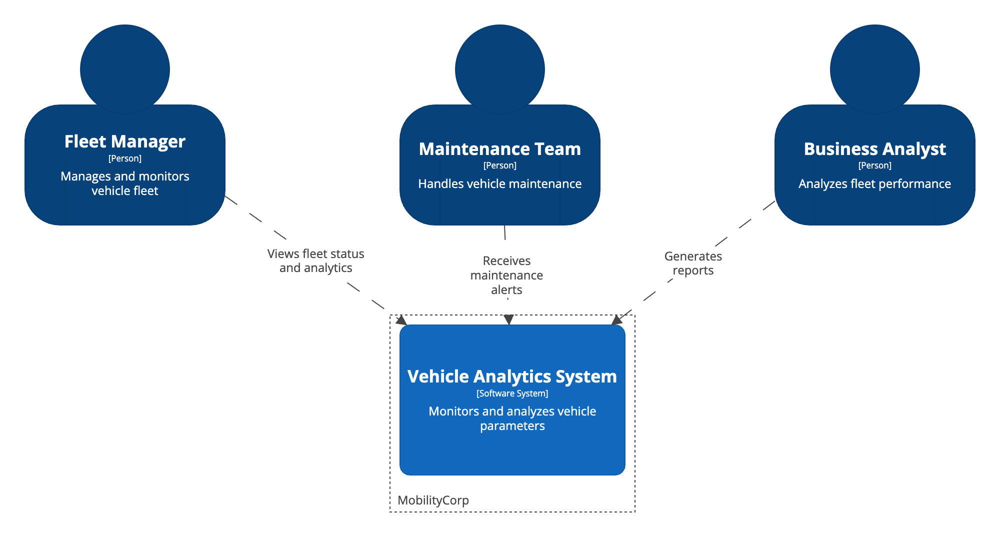
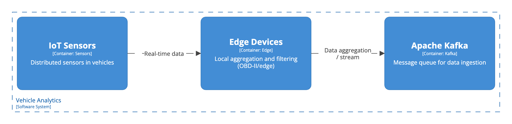
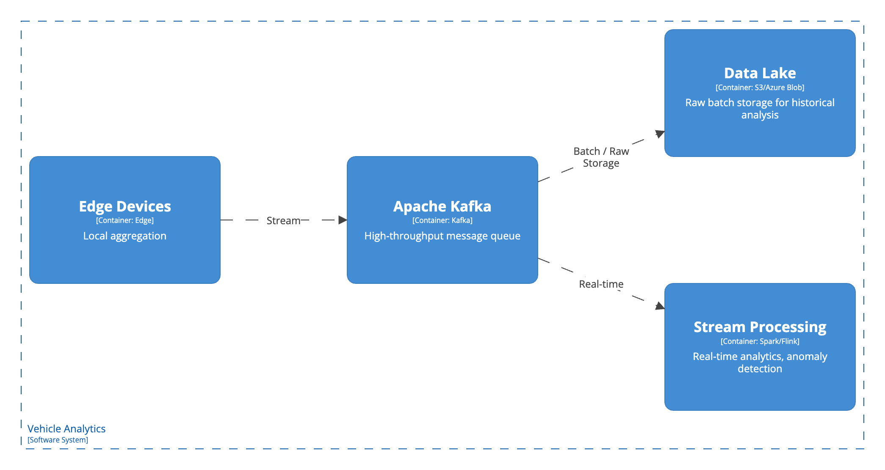
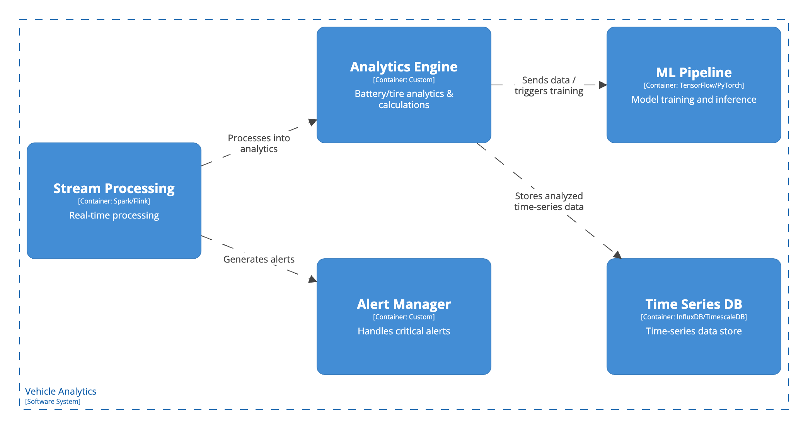
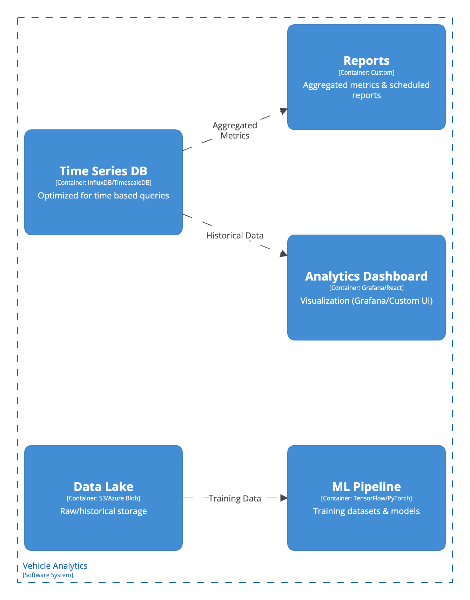
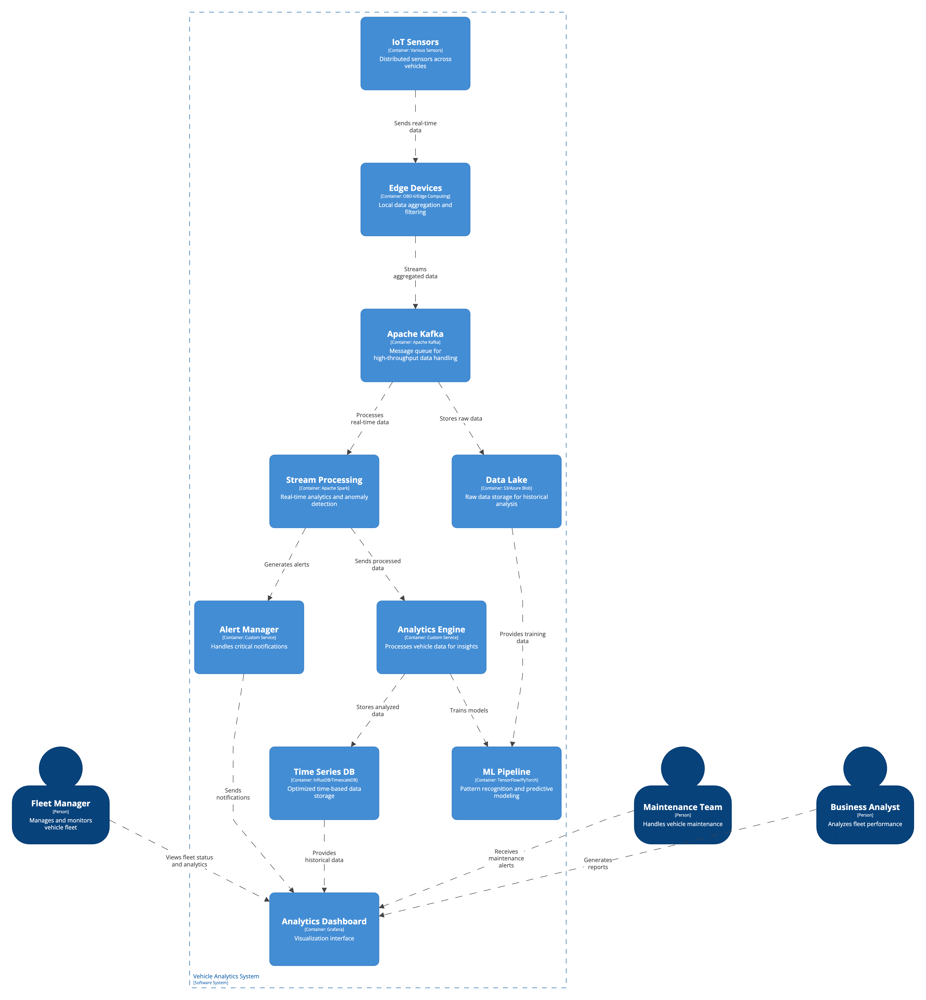

# Vehicle Analytics Architecture Design

## Context
MobilityCorp needs to implement a robust vehicle analytics system to monitor and analyze various vehicle parameters such as:
- E-bike battery life and health
- Tire pressure for cars, vans, and other vehicles
- Vehicle performance metrics
- Maintenance indicators

## Architecture Flow

### 1. Data Collection Layer

#### Components:
- **IoT Sensors**: Distributed across vehicles
  - Battery voltage/current sensors
  - Tire pressure monitoring systems (TPMS)
  - OBD-II sensors for vehicle diagnostics
- **Edge Devices**: 
  - Local data aggregation
  - Initial data filtering
  - Temporary storage for offline scenarios

### 2. Data Ingestion Layer

#### Components:
- **Message Queue (Apache Kafka)**:
  - High-throughput message handling
  - Topic-based data segregation
  - Data buffering for reliability
- **Stream Processing**:
  - Real-time analytics
  - Anomaly detection
  - Critical alerts generation

### 3. Processing Layer

#### Components:
- **Analytics Engine**:
  - Battery health analysis
  - Tire pressure tracking
  - Predictive maintenance calculations
- **ML Pipeline**:
  - Pattern recognition
  - Predictive modeling
  - Anomaly detection

### 4. Storage Layer

#### Components:
- **Time Series Database**:
  - Optimized for time-based queries
  - High-performance data retrieval
  - Data retention policies
- **Data Lake**:
  - Raw data storage
  - Historical analysis
  - ML model training data

### 5. Presentation Layer

#### Components:
- **Analytics Dashboard**:
  - Real-time monitoring
  - Historical trends
  - Predictive insights
- **Alert System**:
  - Critical notifications
  - Maintenance schedules
  - Performance degradation warnings

## Integrated Containers View

## Architecture Summary
Implement a multi-layered architecture with:
1. Distributed data collection through IoT sensors
2. Real-time stream processing for immediate insights
3. Batch processing for detailed analytics
4. ML-powered predictive maintenance
5. Multi-faceted visualization and reporting

## Benefits
- Real-time vehicle health monitoring
- Predictive maintenance capabilities
- Reduced maintenance costs
- Improved fleet reliability
- Data-driven decision making

## Technical Stack Recommendations
1. **Data Collection**:
   - IoT sensors with MQTT protocol
   - Edge computing devices with local processing

2. **Data Processing**:
   - Apache Kafka for message queuing
   - Apache Spark for stream processing
   - Apache Flink for complex event processing

3. **Storage**:
   - InfluxDB/TimescaleDB for time series data
   - Amazon S3/Azure Blob for data lake
   - Redis for caching

4. **Analytics**:
   - TensorFlow/PyTorch for ML models
   - Grafana for visualization
   - Prometheus for metrics

5. **Alerting**:
   - PagerDuty/OpsGenie for critical alerts
   - Custom notification system for regular updates

## Consequences
### Positive
- Comprehensive vehicle monitoring
- Proactive maintenance
- Data-driven fleet management
- Scalable architecture

### Negative
- Complex system maintenance
- High initial setup cost
- Data privacy considerations
- Network dependency

## Notes
- Implement robust offline capabilities
- Consider data retention policies
- Ensure GDPR compliance
- Regular system health monitoring